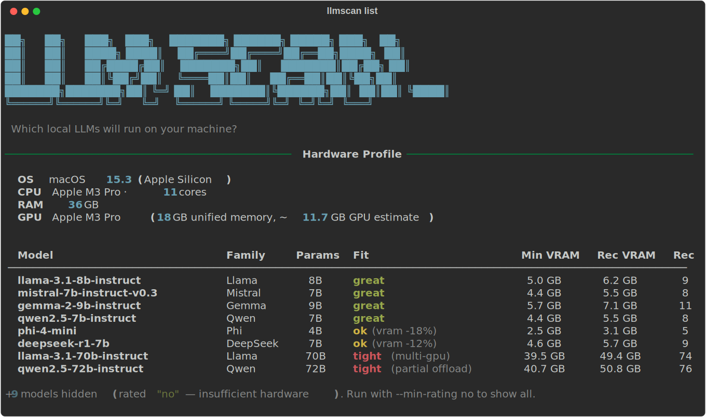

```
 __       __      .___  ___.      _______.  ______     ___      .__   __. 
|  |     |  |     |   \/   |     /       | /      |   /   \     |  \ |  | 
|  |     |  |     |  \  /  |    |   (----`|  ,----'  /  ^  \    |   \|  | 
|  |     |  |     |  |\/|  |     \   \    |  |      /  /_\  \   |  . `  | 
|  `----.|  `----.|  |  |  | .----)   |   |  `----./  _____  \  |  |\   | 
|_______||_______||__|  |__| |_______/     \______/__/     \__\ |__| \__| 
                                                                          
```

> A fast CLI that scans your hardware and tells you which local LLMs will actually run on your machine.

<!-- badges -->
[](https://github.com/adityaarakeri/llmscan/actions/workflows/ci.yml)
[](https://pypi.org/project/llmscan/)
[](https://pypi.org/project/llmscan/)
[](LICENSE)

## Features

- **Auto-detects your hardware** — OS, CPU, RAM, and GPU memory in seconds
- **Multi-vendor GPU support** — NVIDIA (`nvidia-smi`), AMD ROCm (`rocm-smi`), Intel Arc (`xpu-smi`/`clinfo`), Apple Silicon (unified memory), Windows (`Get-CimInstance`/`wmic`)
- **Smart fitness scoring** — Rates every model as `great`, `ok`, `tight`, or `no` with a short reason code (e.g. `ok (cpu-only)`, `ok (vram -25%)`, `tight (multi-gpu)`)
- **Backend-aware scoring** — `--backend ollama|llama-cpp|mlx` adjusts memory overhead estimates for the actual inference backend you're using
- **45+ bundled models** — Llama, Qwen, Mistral, Gemma, Phi, DeepSeek, CodeLlama, StarCoder, and more
- **Hugging Face search** — Find GGUF models on Hugging Face and add them to your local catalog
- **Auto-computed VRAM** — Adds models with formula-derived memory requirements from parameter count and quantization
- **IQ quant support** — Full iMatrix quantization family (`IQ1_S` through `IQ4_NL`) with calibrated VRAM estimates
- **Multi-GPU aware** — Accounts for tensor parallelism across multiple GPUs with per-card breakdown
- **CPU-only inference** — Recognizes when you have enough RAM to run models without a GPU
- **Ollama integration** — `--running` cross-references your catalog against what Ollama has loaded
- **Catalog updates** — Fetch the latest model list from a remote URL without reinstalling; shows a diff of new/updated/removed models
- **Diagnostics** — `llmscan doctor` checks which detection tools are available and flags anomalies
- **Filter and sort** — `--family Llama`, `--sort vram`, `--min-rating ok` for focused output
- **Beautiful terminal UI** — Rich tables, color-coded ratings, ASCII banner
- **CI-friendly** — `--no-color` / `--plain` strips all ANSI formatting for log capture and pipelines
- **Custom catalogs** — Bring your own model list as a JSON file
- **JSON and CSV output** — Pipe results into scripts, dashboards, or spreadsheets with `--json` or `--csv`
- **Shell completions** — `--install-completion` for bash, zsh, and fish
- **Version update check** — `llmscan version --check` pings PyPI to notify you of new releases

## Install

```bash
# With pip
pip install llmscan

# With pipx (isolated install)
pipx install llmscan

# With uv
uv pip install llmscan

# From source
git clone https://github.com/adityaarakeri/llmscan.git
cd llmscan
pip install -e .
```

The installed command remains `llmscan`.

## Demo



## Quick Start

```bash
# Show banner + hardware summary + compatible models
llmscan

# Check version
llmscan --version

# Strip color for CI / log capture (applies to all subcommands)
llmscan --no-color list
llmscan --plain scan --json
```

## Usage

### `scan` — Inspect your hardware

```bash
llmscan scan              # Rich formatted hardware details
llmscan scan --json       # Machine-readable JSON output
```

### `list` — List compatible models

```bash
llmscan list                          # Show models rated "tight" and above
llmscan list --min-rating great       # Only show "great" fits
llmscan list --min-rating no          # Show all models including non-fits
llmscan list --json                   # JSON output with machine profile + models
llmscan list --catalog my_models.json # Use a custom catalog file
llmscan list --family Llama           # Filter by model family (case-insensitive)
llmscan list --sort vram              # Sort by: rating (default), params, vram, name
llmscan list --running                # Mark which models Ollama currently has loaded
llmscan list --backend ollama         # Adjust scoring for Ollama's memory overhead
llmscan list --backend mlx            # Adjust scoring for MLX framework overhead
llmscan list --csv                    # Output as CSV (pipe to a spreadsheet or script)
```

Each row in the table shows a short reason code next to the rating explaining *why* a model received that score — e.g. `ok (cpu-only)`, `ok (vram -25%)`, `tight (multi-gpu)`, `tight (partial offload)`. When models are hidden by the active filter, a summary line at the bottom tells you how many are hidden and how to reveal them.

### `explain` — Deep-dive on a specific model

```bash
llmscan explain llama-3.1-8b-instruct              # Why does this model fit?
llmscan explain qwen2.5-72b-instruct               # Why doesn't it?
llmscan explain my-model --catalog my_models.json   # Explain from a custom catalog
```

### `search` — Find GGUF models on Hugging Face

```bash
llmscan search llama                          # Search for Llama GGUF models
llmscan search "codellama 13b"                # More specific search
llmscan search mistral --limit 5              # Limit results
llmscan search qwen --json                    # JSON output
llmscan search llama --min-params 7           # Only models with 7B+ parameters
llmscan search llama --max-params 13          # Only models up to 13B parameters
llmscan search llama --min-params 7 --max-params 70  # Parameter range filter
```

Models without an inferable parameter count in their name are excluded when either `--min-params` or `--max-params` is active.

### `add` — Add a model to your local catalog

VRAM/RAM requirements are auto-computed from the parameter count and quantization type.

```bash
# Add by specifying params and quant manually
llmscan add my-model --params-b 7 --quant Q4_K_M --family Llama
llmscan add my-model --params-b 7 --quant Q4_K_M --family Llama --notes "My fine-tune"

# Add from a Hugging Face repo (auto-detects params and quant from repo name / filenames)
# llmscan will show what it detected and prompt you to override with --params-b / --quant if wrong
llmscan add TheBloke/Llama-2-7B-GGUF

# Preview computed VRAM/RAM values without writing to catalog
llmscan add my-model --params-b 7 --quant Q4_K_M --dry-run
llmscan add my-model --params-b 7 --quant Q4_K_M --dry-run --json

# Overwrite an existing entry
llmscan add my-model --params-b 7 --quant Q8_0 --family Llama --force

# JSON output
llmscan add my-model --params-b 7 --quant Q4_K_M --json
```

Supported quantization types: `Q2_K`, `Q3_K_S`, `Q3_K_M`, `Q3_K_L`, `Q4_0`, `Q4_K_S`, `Q4_K_M`, `Q5_0`, `Q5_K_S`, `Q5_K_M`, `Q6_K`, `Q8_0`, `F16`, `IQ2_XS`, `IQ3_XS`

Models are saved to `~/.llmscan/catalog.json` and automatically merged with the bundled catalog. If that file becomes malformed, `llmscan` will print a warning and fall back to the bundled catalog rather than crashing.

### `remove` — Remove a model from your local catalog

```bash
llmscan remove my-model   # Only removes user-added models, not bundled ones
```

### `doctor` — Diagnose hardware detection

Checks which detection tools are present on your system (`nvidia-smi`, `rocm-smi`, `xpu-smi`, `sysctl`, `wmic`, `clinfo`), reports their paths, and flags anomalies such as a GPU being detected with 0 VRAM reported.

```bash
llmscan doctor          # Rich table showing tool availability + any anomalies
llmscan doctor --json   # Machine-readable JSON
```

### `catalog update` — Refresh the model list

Fetches the latest `models.json` from a remote URL and merges new or updated entries into your local catalog. Your own custom-added models are always preserved.

```bash
llmscan catalog update                          # Fetch and apply updates
llmscan catalog update --dry-run                # Preview what would change, don't save
llmscan catalog update --json                   # JSON diff output
llmscan catalog update --url https://example.com/catalog.json  # Use a custom URL
```

### `version` — Show version and check for updates

```bash
llmscan version           # Print installed version
llmscan version --check   # Also check PyPI for a newer release (2s timeout)
```

### Global flags

These flags apply to every subcommand and must come before the subcommand name:

| Flag | Description |
|------|-------------|
| `--no-color` | Strip all ANSI color and Rich formatting |
| `--plain` | Alias for `--no-color` |
| `--version`, `-V` | Print version and exit |
| `--install-completion` | Install shell completion for bash/zsh/fish |
| `--show-completion` | Print the completion script for the current shell |

```bash
llmscan --no-color list
llmscan --plain scan --json
llmscan --install-completion zsh
llmscan --show-completion bash
```

### Example Output

```
llmscan list --min-rating ok
```

```
┃ Model                        ┃ Family  ┃ Params ┃ Fit              ┃ Min VRAM ┃ Rec VRAM ┃ Rec RAM ┃
┃ llama-3.1-8b-instruct        ┃ Llama   ┃ 8B     ┃ great            ┃ 5.0 GB   ┃ 6.2 GB   ┃ 10 GB   ┃
┃ mistral-7b-instruct-v0.3     ┃ Mistral ┃ 7B     ┃ great            ┃ 4.4 GB   ┃ 5.5 GB   ┃ 8 GB    ┃
┃ phi-4-mini                   ┃ Phi     ┃ 4B     ┃ ok (vram -22%)   ┃ 2.5 GB   ┃ 3.1 GB   ┃ 6 GB    ┃
┃ qwen2.5-7b-instruct          ┃ Qwen    ┃ 7B     ┃ ok (cpu-only)    ┃ 4.4 GB   ┃ 5.5 GB   ┃ 8 GB    ┃
...
+8 models hidden (rated "no" — insufficient hardware). Run with --min-rating no to show all.
```

## Rating System

| Rating  | Meaning |
|---------|---------|
| `great` | GPU VRAM and RAM both meet recommended targets — best experience |
| `ok`    | Meets minimum requirements; may need moderate context limits or uses CPU-only inference |
| `tight` | Runs with CPU offload, reduced context, or multi-GPU splitting — expect slower performance |
| `no`    | Hardware is below practical minimums |

Each rating is annotated with a short **reason code** shown in parentheses:

| Reason code | When it appears |
|-------------|----------------|
| *(none)* | `great` or `no` — the rating is self-explanatory |
| `vram -N%` | GPU clears the minimum but is N% below recommended VRAM |
| `ram low` | GPU meets recommended VRAM but system RAM is the bottleneck |
| `cpu-only` | No usable GPU; inference runs entirely in system RAM |
| `multi-gpu` | Score depends on combining VRAM across multiple GPUs |
| `partial offload` | GPU handles most layers; remainder offloaded to CPU |
| `cpu offload` | GPU too small to help much; CPU carries most of the load |

## Backend-Aware Scoring

Different inference backends have different memory behaviors. The `--backend` flag adjusts the effective VRAM and RAM thresholds used for scoring so that estimates are accurate for your actual runtime:

| Backend | VRAM overhead | RAM overhead | When to use |
|---------|-------------|-------------|-------------|
| `llama-cpp` | none (baseline) | none | Default; estimates calibrated for llama.cpp |
| `ollama` | +15% | +10% | Ollama's large default context window and serving overhead |
| `mlx` | +10% | none | MLX framework overhead on Apple Silicon |

```bash
llmscan list --backend ollama   # Models scored as if running inside Ollama
llmscan list --backend mlx      # Models scored for Apple MLX runtime
```

The JSON output always includes a `"backend"` field so you know which overhead was applied.

## Ollama Integration

If Ollama is running locally, `--running` cross-references your catalog against `http://localhost:11434/api/tags` and marks which models are currently loaded:

```bash
llmscan list --running           # Adds a "Running" column to the table
llmscan list --running --json    # JSON includes "running": true/false per model
```

If Ollama is not reachable, a warning is shown and all models are marked as not running.

## Supported Hardware

| Vendor | Detection Method | Notes |
|--------|-----------------|-------|
| NVIDIA | `nvidia-smi` | Discrete GPUs with CUDA |
| AMD | `rocm-smi` | GPUs with ROCm drivers |
| Intel | `xpu-smi`, `clinfo` | Arc and Data Center GPUs |
| Apple | `sysctl` | Apple Silicon unified memory (65% GPU estimate) |
| Windows | `Get-CimInstance`, `wmic` | Fallback for any GPU on Windows |

> **WSL2 note:** When running inside WSL2, `llmscan` automatically detects the environment and prints a warning that `nvidia-smi` VRAM readings may be inaccurate. Verify GPU memory on the Windows host before trusting the results.

## Custom Catalogs

Create a JSON file with your own model entries:

```json
[
  {
    "id": "my-custom-model-7b",
    "family": "Custom",
    "params_b": 7,
    "quant": "Q4_K_M",
    "min_vram_gb": 5,
    "recommended_vram_gb": 8,
    "recommended_ram_gb": 16,
    "notes": "My fine-tuned model"
  }
]
```

Then pass it with `--catalog`:

```bash
llmscan list --catalog my_models.json
llmscan explain my-custom-model-7b --catalog my_models.json
```

### Required Fields

| Field | Type | Description |
|-------|------|-------------|
| `id` | string | Unique model identifier |
| `family` | string | Model family name (e.g., "LLaMA", "Mistral") |
| `params_b` | number | Parameter count in billions |
| `quant` | string | Quantization format (e.g., "Q4_K_M", "Q5_K_M") |
| `min_vram_gb` | number | Minimum GPU VRAM in GB |
| `recommended_vram_gb` | number | Recommended GPU VRAM in GB |
| `recommended_ram_gb` | number | Recommended system RAM in GB |
| `notes` | string | Additional notes about the model |

## Development

```bash
git clone https://github.com/adityaarakeri/llmscan.git
cd llmscan

# Install with dev dependencies
uv pip install -e ".[test,dev]"
```

Run all CI checks locally with `make`:

```bash
make          # lint + typecheck + test (same as make ci)
make lint     # ruff check + format check
make format   # auto-format with ruff
make typecheck  # mypy
make test     # pytest
```

Override the Python version with `make PYTHON=3.10 ci`.

Or run the individual commands directly:

```bash
# Run tests
uv run pytest

# Lint and format
uv run ruff check .
uv run ruff format .

# Type check
uv run mypy llmscan/
```

## Contributing

1. Fork the repository
2. Create a feature branch (`git checkout -b feature/my-feature`)
3. Make your changes and add tests
4. Ensure all checks pass: `uv run pytest && uv run ruff check . && uv run mypy llmscan/`
5. Open a pull request

## License

MIT — see [LICENSE](LICENSE) for details.
